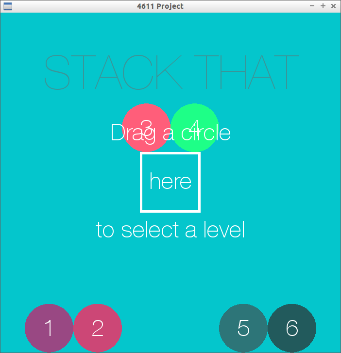
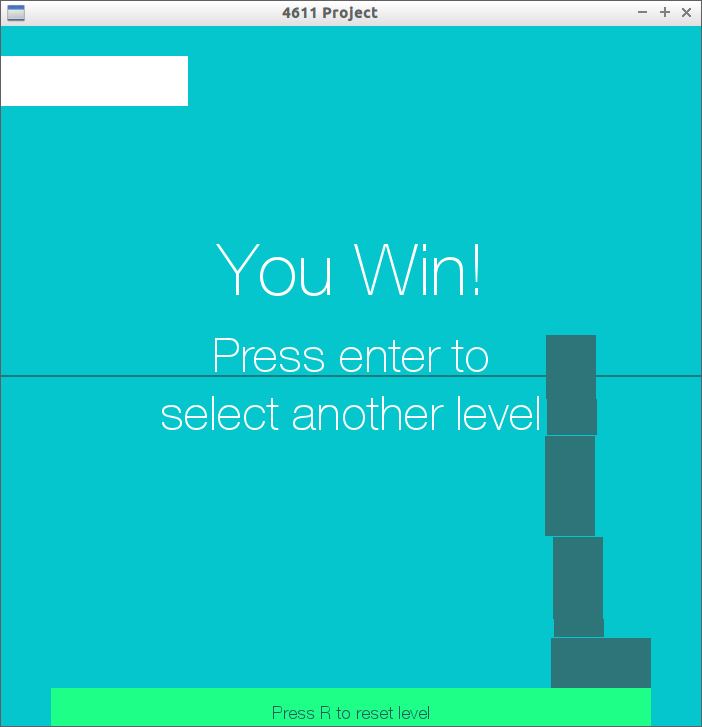

#Tower Building Game
##This is a class project for CSCI 4611 Programming Interactive Computer Graphics and Games
The point of the game is to stack the blocks above the line without them falling over.
###Group members are:
- Luke Peterson pete9348@umn.edu
- Nicole Zhang 
- James McMonigal 
- Jacob Yapp 

